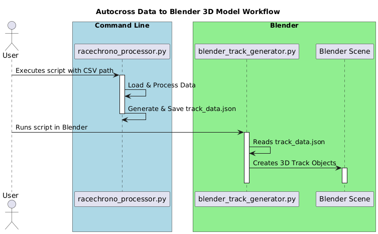

# RaceChrono to Blender Track Generator

This project provides a suite of Python scripts to process RaceChrono CSV exports and generate a 3D track model inside Blender. It separates the data processing from the 3D model generation, allowing for a flexible and repeatable workflow.

## Features

- **Robust Data Loading**: Parses RaceChrono CSV files, automatically detecting column names and handling various file encodings.
- **GPS Processing**: Converts raw GPS coordinates into a smoothed, meter-based XY coordinate system.
- **Track Geometry Generation**: Creates a track centerline, edges, and calculates metadata like length and max speed.
- **Blender Integration**: A dedicated Blender script reads the processed data to build a 3D mesh of the track, complete with a racing line and basic materials.
- **Optional Video Processing**: Can extract reference frames from a video file to aid in manual 3D scene adjustments.

## Requirements

- Python 3.7+
- Pip packages: `pandas`, `opencv-python`, `numpy`
  ```sh
  pip install pandas opencv-python numpy
  ```
- Blender 3.6+

## Workflow Diagram

The process is separated into two main stages: data processing on the command line and model generation inside Blender.



## Usage Instructions

### Step 1: Process RaceChrono Data

Run the `racechrono_processor.py` script from your terminal, pointing it to your RaceChrono CSV export.

**Basic Usage:**
```sh
python racechrono_processor.py --csv "path/to/your_racechrono_data.csv"
```

**With Optional Video for Frame Extraction:**
```sh
python racechrono_processor.py --csv "path/to/your_data.csv" --video "path/to/your_video.mp4"
```

This will create an `output` directory containing:
- `track_data.json`: The geometry data for Blender.
- `processed_gps_data.csv`: The intermediate XY-coordinate data.
- `reference_frames/`: (Optional) Still images from the video.

### Step 2: Generate the 3D Model in Blender

1.  Open Blender.
2.  It is recommended to first save your `.blend` file in the root of this project directory.
3.  Go to the **Scripting** workspace.
4.  Click **Open** and select the `blender_track_generator.py` file.
5.  Click the **Run Script** button (▶).

The script will execute, reading the `output/track_data.json` file and building the track in your scene.

## File Descriptions

- **`racechrono_processor.py`**: The main command-line script for processing the RaceChrono CSV data.
- **`blender_track_generator.py`**: The static script to be run inside Blender for generating the 3D model.
- **`output/track_data.json`**: The key data file that acts as the bridge between the processor and Blender. It contains all the track geometry.
